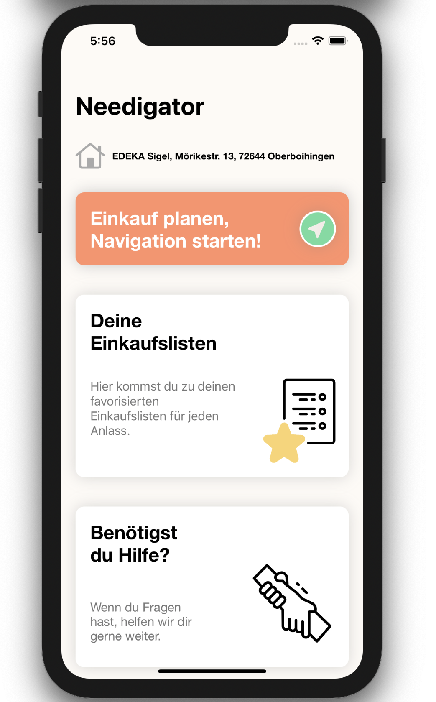
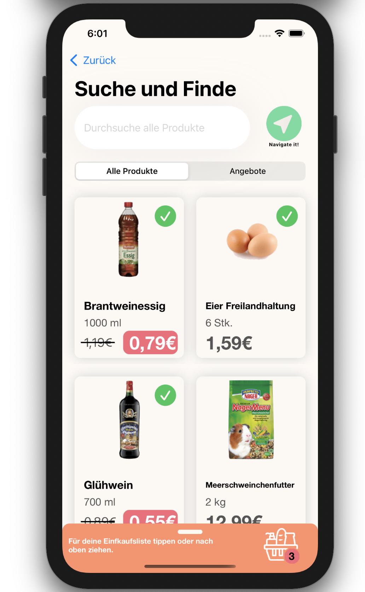
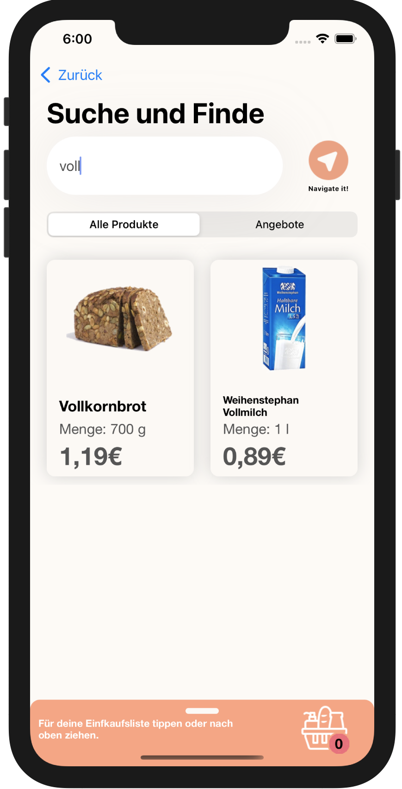
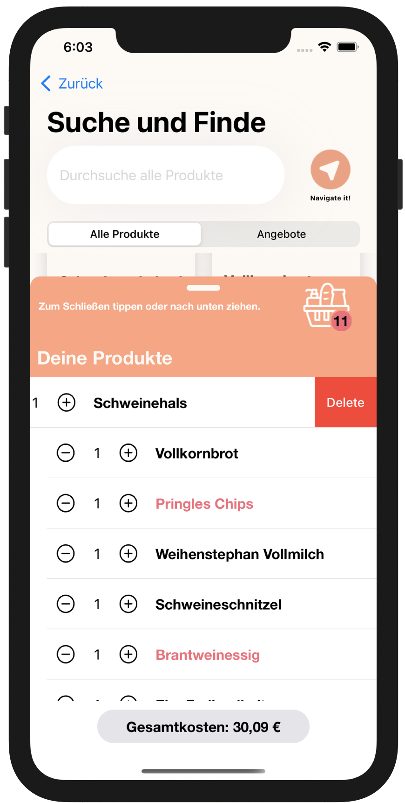
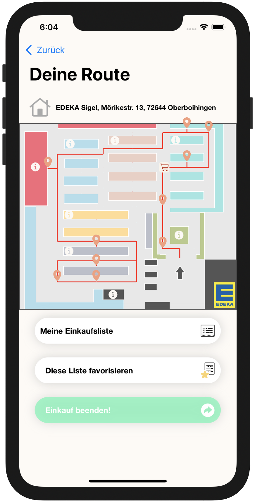
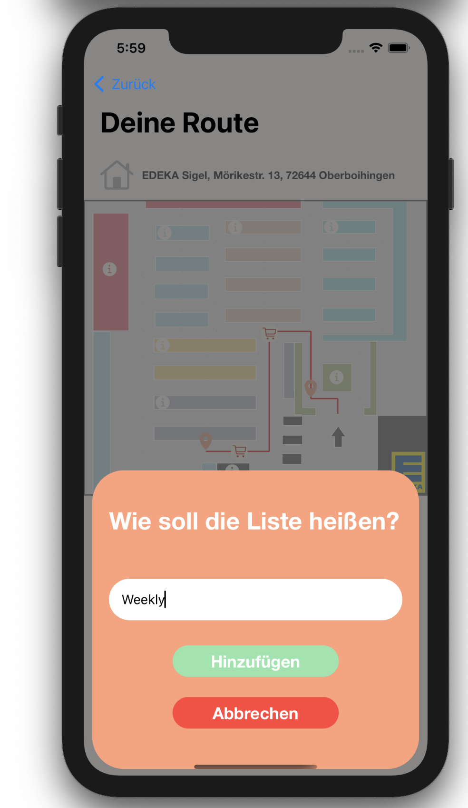

# Needigator
Needigator is an acronym of "needs" and "navigator". The application allows the users to plan their shopping and find the shortest route with the selected products throug the market. The user is able to search all products and offers to build a shopping list. The routing is based on a 2D-map without live tracking.
More details in Funtionality and Showroom sections below.

# Purpose
This was a serious app project, which was presented to a local market. The feedback was great, but we did not get the deal, because the cooperative of this market
didn't want us to acces their product data base system - which of course is nessecary for this application.

Nevertheless I put a bunch of work in this and learned so much. Therefore I want to share it in my portfolio.

# Functionality
- Search prducts from market
- Select products with amount and add them to the shopping list
- Make product requests, when not available
- Search offers in market
- Calculate the route 
- Get a 2D map with pins at the nodes with seleced productss 
- Check the collected products at the node 
- Save the List as a favorite List with date and name
- Chose a favorite list as a starting point to plan a new shopping event

# Techniques
- CoreData
- Networking (Using API to AWS data base from team member)
- Protocols and Delegates
- TableView / ScrollView
- ImageManipulation (The route is drawn pixle per pixle)

# Algortihm
The calculation bases on the simulated annelaing algorithm which solves the travelling salesman problem (k.a. TSP).

# Showroom

Find all screenshots of the functionality in the ./Screens folder

